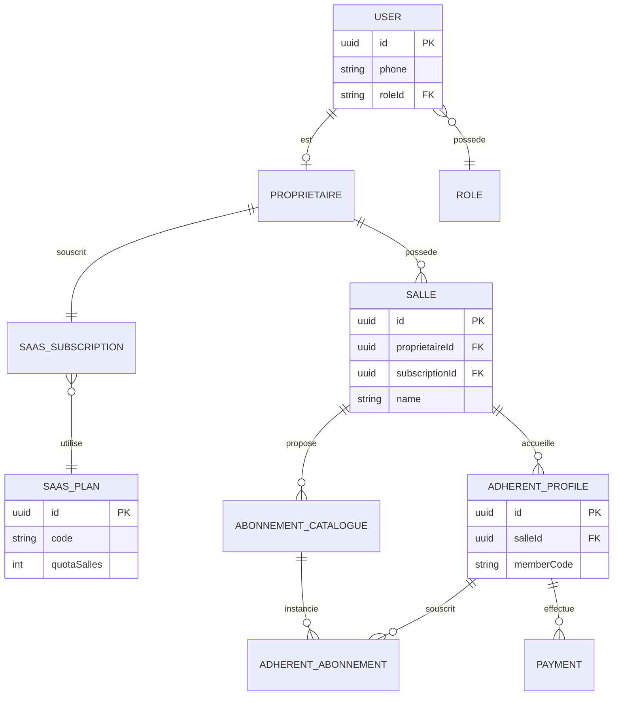

# ERD simplifié — entités centrales

Ce diagramme montre les 8 entités centrales du modèle (sur 35 au total). Le détail complet est dans `schema.prisma`. Ouvrir ce fichier sur GitHub ou dans un éditeur supportant mermaid pour un rendu visuel.

## Groupes d'entités non représentés ici (voir `schema.prisma`)

- RBAC détaillé : `Permission`, `RolePermission`
- SaaS avancé : `SaasCountryPricing`, `SaasAddon`, `SaasPlanAddon`, `SaasSubscriptionAddon`, `SaasInvoice`
- Contrôle d'accès : `AccessLog`
- Réservations : `CoursCollectif`, `Booking`, `WaitingListEntry`, `CoachAvailability`
- Paiements détaillés : `Receipt`
- Marketing : `MessageTemplate`, `MarketingCampaign`, `Coupon`
- Sécurité : `AuditLog`, `ApiCredential`, `RefreshToken`, `LoginHistory`
- Internationalisation : `Country`
